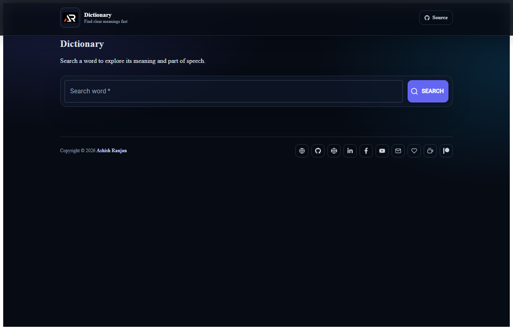

# Dictionary

A focused React dictionary app that searches a word and displays its meaning and part of speech using the Datamuse API.



## Features

- Word search with loading and error states
- Meaning and part-of-speech results
- Responsive Material UI form and result cards
- Fixed branded header, icon-only footer links, and go-to-top control

## Tech stack

React, Create React App, Material UI, Axios, Sass, React Icons, and React Toastify.

## Run locally

```bash
npm install
npm start
```

Build and deploy to GitHub Pages:

```bash
npm run build
npm run deploy
```

## Links

- Portfolio: [https://www.ashishranjan.net/](https://www.ashishranjan.net/)
- GitHub: [https://github.com/a2rp](https://github.com/a2rp)
- CodePen: [https://codepen.io/ash1198](https://codepen.io/ash1198)
- LinkedIn: [https://www.linkedin.com/in/aashishranjan](https://www.linkedin.com/in/aashishranjan)
- Facebook: [https://www.facebook.com/theash.ashish/](https://www.facebook.com/theash.ashish/)
- YouTube: [https://www.youtube.com/@ashishranjan-ashz?sub_confirmation=1](https://www.youtube.com/@ashishranjan-ashz?sub_confirmation=1)
- Email: [mailto:ash.ranjan09@gmail.com](mailto:ash.ranjan09@gmail.com)

## Support

- Support: [https://a2rp-donation-page.netlify.app/](https://a2rp-donation-page.netlify.app/)
- Buy Me a Coffee: [https://buymeacoffee.com/a2rp](https://buymeacoffee.com/a2rp)
- Patreon: [https://www.patreon.com/a2rp](https://www.patreon.com/a2rp)
